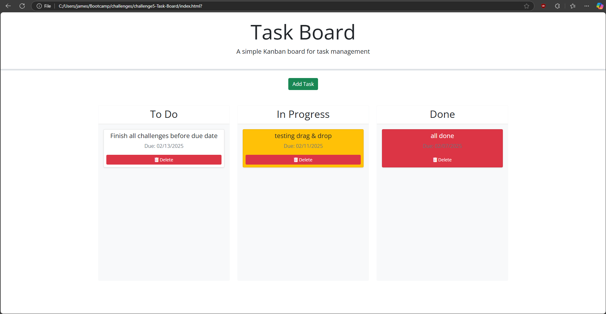

# challenge5-Task-Board

## Description

#### Overview

This app is pretty simple yet incredibly useful. Its a task management site that allows a user to add tasks that they have to do, as well as adding a date to the tasks to help them keep track of when they need to be completed. The tasks are also color coated depending on how close they are to the deadline.

#### Dependencies

1. jQuery

2. Day.js (for use of its date features.)
  
## Screenshot

---

**Github Repo:**

[Github Repo](https://github.com/JoseGuache/challenge5-Task-Board)

**Github Live Page:**

[Github Pages](https://joseguache.github.io/challenge5-Task-Board/)

## Credits

I used [MDN Web Docs](https://developer.mozilla.org/en-US/) for help with some elements and [Professional README Guide](https://coding-boot-camp.github.io/full-stack/github/professional-readme-guide) for help structuring the README. Aslo had to use [ChatGPT](https://chatgpt.com/) for help debugging, but unfortunatly it was NOT much help.
 
## License

